# SwifMetro Documentation
### Version 1.0.0 | Official Documentation

---

## Table of Contents

1. [Overview](#overview)
2. [How It Works](#how-it-works)
3. [Installation](#installation)
4. [Quick Start](#quick-start)
5. [API Reference](#api-reference)
6. [Architecture](#architecture)
7. [Configuration](#configuration)
8. [Advanced Usage](#advanced-usage)
9. [Troubleshooting](#troubleshooting)
10. [FAQ](#faq)

---

## Overview

SwifMetro is a real-time terminal logging system for native iOS applications. It enables developers to see logs from physical iOS devices instantly in their Mac's terminal, without Xcode console or USB cables.

### Key Features

- ⚡ **Instant Logging**: See logs in <4ms
- 📱 **Wireless**: No USB cable required
- 🔍 **Auto-Discovery**: No manual IP configuration
- 📊 **Structured Logging**: JSON support for complex data
- 💾 **Offline Support**: Queue messages when disconnected
- 🎯 **Zero Dependencies**: Uses native iOS APIs

---

## How It Works

### The Technology Stack

SwifMetro uses a **client-server architecture** with WebSocket communication:

```
┌─────────────────┐      WebSocket       ┌─────────────────┐
│                 │  ←─────────────────→  │                 │
│   iOS Device    │       Port 8081       │    Mac Server   │
│                 │                       │                 │
└─────────────────┘                       └─────────────────┘
        ↓                                          ↓
  SwifMetroClient                            Terminal Output
```

### Components

#### 1. iOS Client (`SwifMetroClient.swift`)
- Uses `URLSessionWebSocketTask` (native iOS API)
- Implements Bonjour/mDNS for auto-discovery
- Manages WebSocket connection lifecycle
- Queues messages when offline

#### 2. Node.js Server (`swifmetro-server.js`)
- WebSocket server using `ws` package
- Broadcasts via Bonjour for discovery
- Handles multiple simultaneous connections
- Formats and colors output for terminal

#### 3. Communication Protocol
- **Discovery**: Bonjour service `_swifmetro._tcp`
- **Transport**: WebSocket over TCP port 8081
- **Format**: UTF-8 text or JSON
- **Security**: Optional token authentication

### The Connection Flow

```mermaid
sequenceDiagram
    participant App as iOS App
    participant Client as SwifMetroClient
    participant Server as Mac Server
    participant Terminal as Terminal
    
    App->>Client: SwifMetroClient.shared.start()
    Client->>Client: Discover via Bonjour
    Client->>Server: WebSocket Connect
    Server->>Terminal: "🔥 iPhone Connected!"
    Client->>Server: Device Info (JSON)
    App->>Client: log("Button tapped")
    Client->>Server: Send log message
    Server->>Terminal: Display with timestamp
```



---

## Installation

### Requirements

- **iOS**: 14.0+
- **macOS**: 10.15+ with Node.js 14+
- **Xcode**: 12.0+
- **Network**: Devices on same WiFi

### Method 1: Automatic Installation

```bash
# Clone repository
git clone https://github.com/csainsworth123/swifmetro.git
cd swifmetro

# Run installer
./install-swifmetro.sh
```

### Method 2: Swift Package Manager

In Xcode:
1. File → Add Packages
2. Enter: `https://github.com/csainsworth123/swifmetro.git`
3. Choose version: Up to Next Major → 1.0.0

### Method 3: Manual Installation

```bash
# Install Node.js dependencies
npm install ws bonjour

# Copy SwifMetroClient.swift to your project
cp SwifMetroClient.swift /path/to/your/project/
```

---

## Quick Start

### 1. Start the Server

```bash
# Basic server
node swifmetro-server.js

# Advanced server with features
node swifmetro-advanced-server.js
```

You'll see:
```
╔══════════════════════════════════════════════╗
║            🚀 SWIFMETRO SERVER              ║
║    Terminal Logging for Native iOS          ║
╚══════════════════════════════════════════════╝

✅ Server Configuration:
   Port: 8081
   Cloud Sync: Disabled
   Hot Reload: Disabled
   
📱 Connect your iPhone to one of these IPs:
──────────────────────────────────────────────
   192.168.1.100 (en0)
──────────────────────────────────────────────

⏳ Waiting for iPhone connections...
```

### 2. iOS Integration

#### AppDelegate.swift
```swift
import UIKit

@main
class AppDelegate: UIResponder, UIApplicationDelegate {
    
    func application(_ application: UIApplication, 
                     didFinishLaunchingWithOptions launchOptions: [UIApplication.LaunchOptionsKey: Any]?) -> Bool {
        
        // Start SwifMetro
        #if DEBUG
        SwifMetroClient.shared.start()
        #endif
        
        return true
    }
}
```

#### Info.plist
```xml
<key>NSAppTransportSecurity</key>
<dict>
    <key>NSAllowsArbitraryLoads</key>
    <true/>
    <key>NSAllowsLocalNetworking</key>
    <true/>
</dict>
```

### 3. Basic Usage

```swift
// Simple logging
SwifMetroClient.shared.log("App launched")

// With emoji helpers
SwifMetroClient.shared.logSuccess("Login successful")
SwifMetroClient.shared.logError("Network error: \(error)")
SwifMetroClient.shared.logWarning("Low memory")
SwifMetroClient.shared.logInfo("User navigated to settings")
SwifMetroClient.shared.logDebug("Cache size: 42MB")

// Structured data
SwifMetroClient.shared.logData("user_action", data: [
    "screen": "home",
    "action": "button_tap",
    "timestamp": Date()
])
```

---

## API Reference

### SwifMetroClient

#### Properties

| Property | Type | Description |
|----------|------|-------------|
| `shared` | `SwifMetroClient` | Singleton instance |
| `isConnected` | `Bool` | Connection status |

#### Methods

##### `start()`
Starts auto-discovery and connects to server.
```swift
SwifMetroClient.shared.start()
```

##### `log(_ message: String)`
Sends a log message to terminal.
```swift
SwifMetroClient.shared.log("User tapped button")
```

##### `logData<T: Encodable>(_ event: String, data: T)`
Sends structured data as JSON.
```swift
struct UserAction: Encodable {
    let screen: String
    let action: String
}

SwifMetroClient.shared.logData("interaction", data: UserAction(
    screen: "home",
    action: "refresh"
))
```

##### `logNetwork(method: String, url: String, status: Int?, duration: TimeInterval?)`
Logs network requests with timing.
```swift
SwifMetroClient.shared.logNetwork(
    method: "GET",
    url: "https://api.example.com/users",
    status: 200,
    duration: 0.234
)
```

##### `logPerformance(_ metric: String, value: Double, unit: String)`
Logs performance metrics.
```swift
SwifMetroClient.shared.logPerformance("FPS", value: 59.94, unit: "fps")
SwifMetroClient.shared.logPerformance("Memory", value: 142.5, unit: "MB")
```

##### `getStatistics() -> SessionStats`
Returns current session statistics.
```swift
let stats = SwifMetroClient.shared.getStatistics()
print("Logs sent: \(stats.logCount)")
print("Uptime: \(stats.uptimeSeconds)s")
```

---

## Architecture

### Network Discovery

SwifMetro uses **Bonjour/mDNS** for automatic server discovery:

1. **Server broadcasts**: `_swifmetro._tcp` service on port 8081
2. **Client searches**: Using `NWBrowser` for the service
3. **Fallback mechanism**: Tries common local IPs if Bonjour fails
4. **Connection established**: WebSocket connection to discovered IP

### Message Flow

```
Application Layer
       ↓
SwifMetroClient.log()
       ↓
Message Queue (if offline)
       ↓
URLSessionWebSocketTask
       ↓
WebSocket Frame (Text/JSON)
       ↓
TCP/IP Layer
       ↓
WiFi Network
       ↓
Node.js Server (ws)
       ↓
Terminal Output (formatted)
```

### Data Format

#### Plain Text Message
```json
"[2025-09-30T21:23:22Z] Button tapped!"
```

#### Structured Message
```json
{
  "event": "user_interaction",
  "data": {
    "screen": "home",
    "action": "button_tap",
    "element": "login_button"
  },
  "timestamp": "2025-09-30T21:23:22Z"
}
```

---

## Configuration

### Server Configuration

Create `swifmetro.config.js`:
```javascript
module.exports = {
  port: 8081,                    // WebSocket port
  host: '0.0.0.0',               // Listen on all interfaces
  serviceName: 'SwifMetro',       // Bonjour service name
  enableCloud: false,             // Enable cloud features
  enableHotReload: false,         // Experimental hot reload
  maxLogHistory: 10000,           // Max logs to store
  authToken: null                 // Optional auth token
};
```

### Client Configuration

```swift
// Custom configuration
SwifMetroClient.shared.configure(
    port: 8081,
    maxQueueSize: 1000,
    reconnectInterval: 5.0,
    enableCompression: false
)
```

---

## Advanced Usage

### SwiftUI Integration

```swift
import SwiftUI

struct ContentView: View {
    var body: some View {
        Text("Hello, World!")
            .swifMetroTracking("ContentView")
            .onTapGesture {
                SwifMetroClient.shared.log("Text tapped")
            }
    }
}

// View modifier for automatic tracking
extension View {
    func swifMetroTracking(_ name: String) -> some View {
        self
            .onAppear {
                SwifMetroClient.shared.log("📱 View appeared: \(name)")
            }
            .onDisappear {
                SwifMetroClient.shared.log("👋 View disappeared: \(name)")
            }
    }
}
```

### Network Interceptor

```swift
// URLSession extension
extension URLSession {
    func dataTaskWithLogging(with request: URLRequest, 
                             completionHandler: @escaping (Data?, URLResponse?, Error?) -> Void) -> URLSessionDataTask {
        
        let startTime = Date()
        SwifMetroClient.shared.log("🌐 \(request.httpMethod ?? "GET") \(request.url?.absoluteString ?? "")")
        
        return dataTask(with: request) { data, response, error in
            let duration = Date().timeIntervalSince(startTime)
            
            if let httpResponse = response as? HTTPURLResponse {
                SwifMetroClient.shared.logNetwork(
                    method: request.httpMethod ?? "GET",
                    url: request.url?.absoluteString ?? "",
                    status: httpResponse.statusCode,
                    duration: duration
                )
            }
            
            completionHandler(data, response, error)
        }
    }
}
```

### Custom Commands

```swift
// Register command handlers
SwifMetroClient.shared.registerCommand("screenshot") {
    // Take and send screenshot
}

SwifMetroClient.shared.registerCommand("clear") {
    // Clear local cache
}
```

---

## Troubleshooting

### Connection Issues

| Problem | Solution |
|---------|----------|
| "No connection" | Ensure devices on same WiFi network |
| "Connection refused" | Check server is running on port 8081 |
| "Discovery timeout" | Try manual IP configuration |
| "WebSocket error" | Update Info.plist with NSAppTransportSecurity |

### Debugging

Enable verbose logging:
```swift
SwifMetroClient.shared.enableVerboseLogging = true
```

Check server logs:
```bash
node swifmetro-server.js --verbose
```

Test connection:
```bash
# From iPhone's network
ping 192.168.1.100
telnet 192.168.1.100 8081
```

---

## FAQ

### Q: Is SwifMetro safe for production?
**A:** SwifMetro only runs in DEBUG builds by default. No code executes in release builds.

### Q: Does it work with real devices?
**A:** Yes! It's designed specifically for real devices over WiFi. No USB needed.

### Q: Can multiple devices connect?
**A:** Yes, the server handles multiple simultaneous connections.

### Q: What's the performance impact?
**A:** Minimal. <0.1% CPU usage, <100KB memory overhead.

### Q: Does it work through VPN?
**A:** It depends on VPN configuration. Local network access must be allowed.

### Q: Can I use it with CI/CD?
**A:** Yes, SwifMetro can run headless for automated testing.

---

## License

MIT License - see LICENSE file

---

## Support

- **GitHub Issues**: [github.com/csainsworth123/swifmetro/issues](https://github.com/csainsworth123/swifmetro/issues)
- **Discord**: [discord.gg/swifmetro](https://discord.gg/swifmetro)
- **Email**: support@swifmetro.dev

---

*SwifMetro - Created September 30, 2025*  
*The technology that revolutionized iOS debugging*